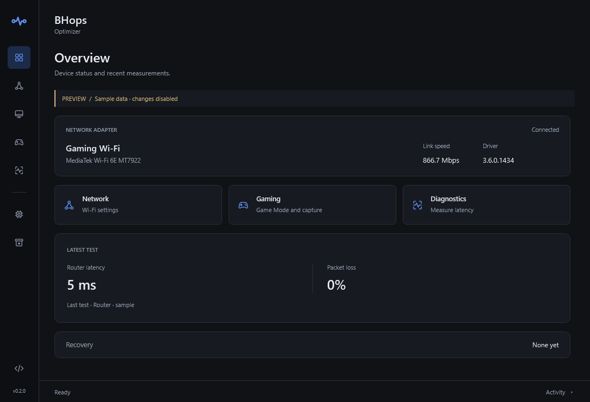

# BHops Optimizer

A Windows desktop utility for Wi-Fi tuning, practical Windows preferences, and a separate gaming selection. Choose settings, preview the changes, apply them automatically, and restore their original values from a backup.

The v0.2 interface uses a charcoal theme, electric blue accents, original vector icons, and a compact navigation rail. Settings show concise titles with explanatory tooltips. Preview results start with a short summary; expand **View changes** to compare readable current and proposed values. Activity is available in an expandable drawer. Page transitions respect the Windows animation preference.

[Download the latest release](https://github.com/Bh0ps/bhops-optimizer/releases/latest) · [Source](https://github.com/Bh0ps/bhops-optimizer) · [MIT license](LICENSE)



## Get started

1. Download `BHopsOptimizer.exe` or the portable ZIP from **Releases**.
2. Open the app. No changes are made on launch.
3. Open **Network**, **System**, or **Gaming** and select the settings you want.
4. Use **Preview changes**, then **Apply selected**. Administrator approval is requested only for operations that need it.
5. Use **Diagnostics** to compare short connection tests and **Backups** to undo an operation.

Hover a navigation icon to see its section, or use Tab to move between controls. Hover a setting for its explanation and restart notes. The overview shows the selected adapter, driver and link speed, plus latency and loss from the current session's most recent test. Before a test runs, these measurements remain empty.

The standalone EXE includes its PowerShell source and uses Windows PowerShell 5.1 / .NET Framework already provided with Windows. No Python, package manager, or separate .NET SDK is required. Source users can launch `Start-BHopsOptimizer.cmd` instead.

Release binaries are currently unsigned. SHA-256 checksums are included in `SHA256SUMS.txt`. Review the source before running privileged changes, especially on a managed PC.

## What is included

| Section | Features |
| --- | --- |
| Network | Physical Wi-Fi adapter detection, prefer 5 GHz with fallback, lower roaming, adapter/device power saving, optional transmit power, U-APSD, and AC wireless power settings |
| System | Show file extensions, optional window/taskbar animations, advertising-ID and tailored-experience preferences |
| Gaming | Game Mode and background capture selection; optional desktop mouse acceleration and an existing High performance power plan |
| Diagnostics | Concurrent router/internet ICMP tests; loss, average, 95th percentile, maximum RTT, successive RTT variation, and background traffic; JSON export |
| Drivers | Reviewed exact-hardware-ID update offers, package verification, current-driver export before installation, and restart reporting |
| Backups | Immutable original snapshots, verified restore, recovery backups, separate operation status, and failure rollback |

The default Gaming selection enables Game Mode and disables retrospective background recording. Manual Game Bar recording remains available. Disabling background recording removes the ability to save a clip of something that already happened.

Privacy choices are optional preferences, not FPS optimizations. Desktop mouse acceleration may have no effect in games using raw input. High performance is optional because it can increase power use, heat, and fan noise. Settings that need a new sign-in or a game restart say so in the interface.

## How changes are handled

- Only exposed, supported adapter capabilities are used. Display labels are paired with the driver's actual valid values; unrecognized, ambiguous, or unsupported options are skipped.
- Virtual Wi-Fi Direct and hosted-network adapters are ineligible for tuning.
- A backup is written before mutation. Apply is idempotent: an already configured selection does not make a new backup or restart the adapter.
- Changes are read back and verified. Write, verification, or required reconnect failures trigger rollback; a rollback failure is reported rather than hidden.
- Restore checks machine/user or adapter identity and validates its allowed setting targets. It restores the values that existed before the operation, including absent registry values and their original datatypes.
- Driver updates and PC restarts remain explicit choices. The app does not run at startup, schedule background tweaks, upload diagnostics, or disable Windows security features.

Local state is stored in `%LOCALAPPDATA%\BHopsOptimizer\State`. Backups and driver-package exports may contain local device identifiers; they are not uploaded. The EXE extracts its bundled source into a unique runtime folder, hosts the WPF interface, and removes that runtime folder on exit. Keep your state folder if you need Undo.

## Automatic driver support

Automatic driver installation currently supports **Windows 11 x64, build 22621 or newer**, with the reviewed **MediaTek MT7922 / RZ616** hardware ID `PCI\VEN_14C3&DEV_0616&SUBSYS_E0CD105B`, using Microsoft Catalog driver **3.6.0.1434**. It will not downgrade an equal or newer installed driver. Other adapters receive a Microsoft Catalog search handoff; no arbitrary package is automatically selected.

Before installation, the app checks Windows build and x64 support, a pinned SHA-256 hash, the exact Network-class INF hardware match, the expected driver version, the Microsoft-signed catalog, and INF membership in that catalog. It exports the existing OEM driver first and lets PnPUtil validate/install only the selected INF. Windows can request a restart even if the updated version is already visible; the app reports that requirement and never restarts automatically.

Settings Undo does not downgrade a driver. Use **Device Manager → Network adapters → adapter → Properties → Driver → Roll Back Driver** if available. The exported original package is retained in the local state folder for recovery.

## Presets and command-line automation

Run these from the cloned or downloaded source directory. If script execution is restricted, open a session with `powershell.exe -NoProfile -ExecutionPolicy Bypass`; this applies only to that session. Use an administrator Windows PowerShell for actual network/driver mutations or performance-plan changes. Preview and `-WhatIf` do not need elevation.

```powershell
# Inspect adapters and settings without changing them
.\BHopsOptimizer.ps1 -Action Inventory
.\BHopsOptimizer.ps1 -Action Plan -Preset Gaming

# Apply the Gaming preset: default Wi-Fi selection + Game Mode/background capture
.\BHopsOptimizer.ps1 -Action Apply -Preset Gaming -WhatIf
.\BHopsOptimizer.ps1 -Action Apply -Preset Gaming

# Apply just network or Windows selections
.\BHopsOptimizer.ps1 -Action Apply -Preset Network
.\BHopsOptimizer.ps1 -Action Apply -Preset System

# Choose explicit options; use -AdapterId when several Wi-Fi adapters are active
.\BHopsOptimizer.ps1 -Action Apply -AdapterId '<adapter-guid>' `
    -Options Prefer5GHz,LowRoaming,DisablePowerSaving
.\BHopsOptimizer.ps1 -Action SystemApply -Tweaks enable-game-mode,disable-background-capture

# Diagnostic and driver checks
.\BHopsOptimizer.ps1 -Action Diagnose -Samples 100
.\BHopsOptimizer.ps1 -Action DriverCheck
.\BHopsOptimizer.ps1 -Action DriverInstall -OfferId '<reviewed-offer-id>' -WhatIf

# Undo a recorded operation
.\BHopsOptimizer.ps1 -Action Restore -BackupPath '<network-backup.json>'
.\BHopsOptimizer.ps1 -Action SystemRestore -BackupPath '<system-backup.json>'
```

Presets: `Network` contains the three default Wi-Fi choices; `Gaming` adds Game Mode/background recording; `System` and `Minimal` currently select file extensions. The GUI lets you choose additional options individually. Combined CLI presets consist of separate network and system transactions; if the second step fails, the completed first step and its backup are reported for Undo.

The executable opens the GUI. `--demo` opens clearly labelled sample data with mutations disabled. CLI automation is provided by the inspectable PowerShell entry script.

## Connection-test limits

ICMP follows Windows routing. Selecting an adapter identifies its gateway, hardware, and traffic counters; it does not force public probes through that interface when multiple connections or a VPN are active. Router spikes may reflect the Wi-Fi link, router ICMP handling, or host scheduling. Short results and their background traffic are evidence to compare, not a guarantee of in-game latency or higher FPS.

## Build and test

The portable EXE is built from the same source in this repository, with the Windows .NET Framework C# compiler and Windows PowerShell automation assembly.

```powershell
.\scripts\Test.ps1
.\scripts\Build.ps1
```

`dist` contains the standalone EXE, portable ZIP, and checksums. The tests use fake networking/registry/power/driver providers: they cover capability detection, idempotence, exact backups and restore, partial failures, rollback, hardware binding, package/signature guards, restart reporting, worker-path validation, latency math, and readable preview values. They do not apply real tweaks to the test PC. The native interface and read-only inventory/preview are also checked separately.

Editable branding and the 17-icon vector set live in `assets`. `brand.json` supplies the shared connection-mark geometry; the build regenerates the multi-resolution Windows icon from it. See [assets/README.md](assets/README.md) for vector usage. The original artwork uses the same MIT license as the app.

Developed and tested on Windows 11 x64 with Windows PowerShell 5.1. The source checks Windows 10/11 client capabilities; Windows 10 has not been live-tested. ARM64, Windows Server, and cross-account administrator elevation are not supported by the portable x64 release. GUI workers refuse elevation as a different account so HKCU does not target the wrong user. CLI settings apply to the account running PowerShell.

## References and project history

The selectable presets and apply/undo workflow are inspired by [Chris Titus Tech's WinUtil](https://github.com/ChrisTitusTech/winutil). BHops Optimizer is an independent implementation; it is not a WinUtil fork or affiliated release.

Each Windows selection carries its source links in `Get-BhoSystemTweaks`. Key references:

- [Microsoft: adapter advanced properties and valid values](https://learn.microsoft.com/en-us/powershell/module/netadapter/get-netadapteradvancedproperty)
- [Microsoft: changing adapter properties](https://learn.microsoft.com/en-us/powershell/module/netadapter/set-netadapteradvancedproperty)
- [Microsoft: Wi-Fi troubleshooting and power-saving settings](https://support.microsoft.com/en-us/windows/experience/connectivity-networking/fix-wi-fi-connection-issues-in-windows)
- [Microsoft: powercfg commands](https://learn.microsoft.com/en-us/windows-hardware/design/device-experiences/powercfg-command-line-options)
- [Reviewed MediaTek Catalog offer](https://www.catalog.update.microsoft.com/ScopedViewInline.aspx?updateid=18130bb5-2ffd-4b10-b9a3-1cd04bfcabf3)

Contributions are welcome. See [CONTRIBUTING.md](CONTRIBUTING.md) and [SECURITY.md](SECURITY.md).
